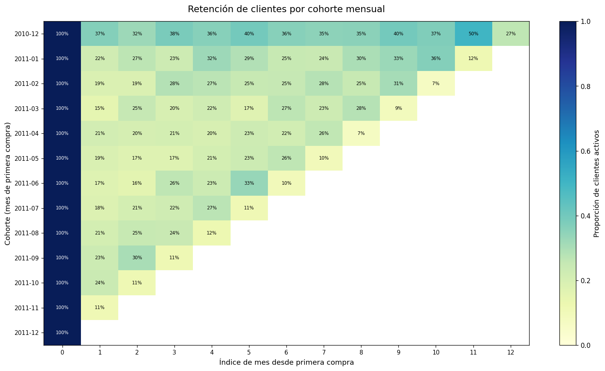
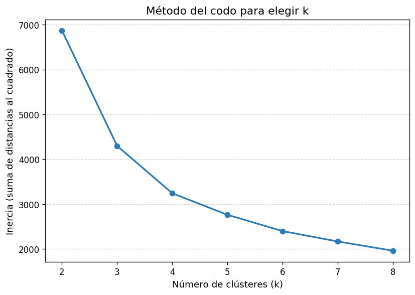
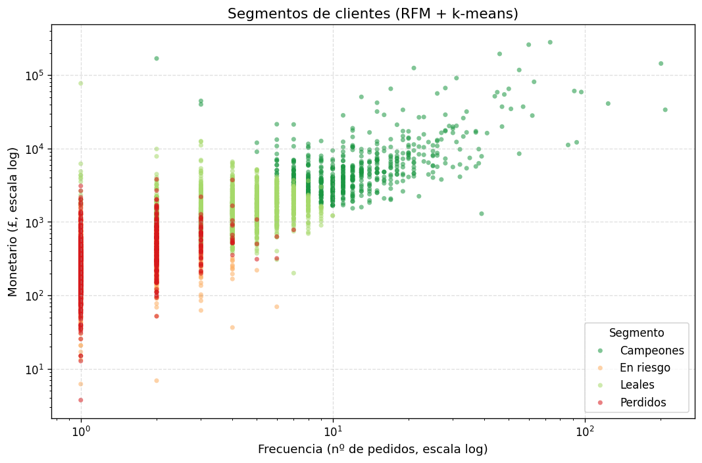
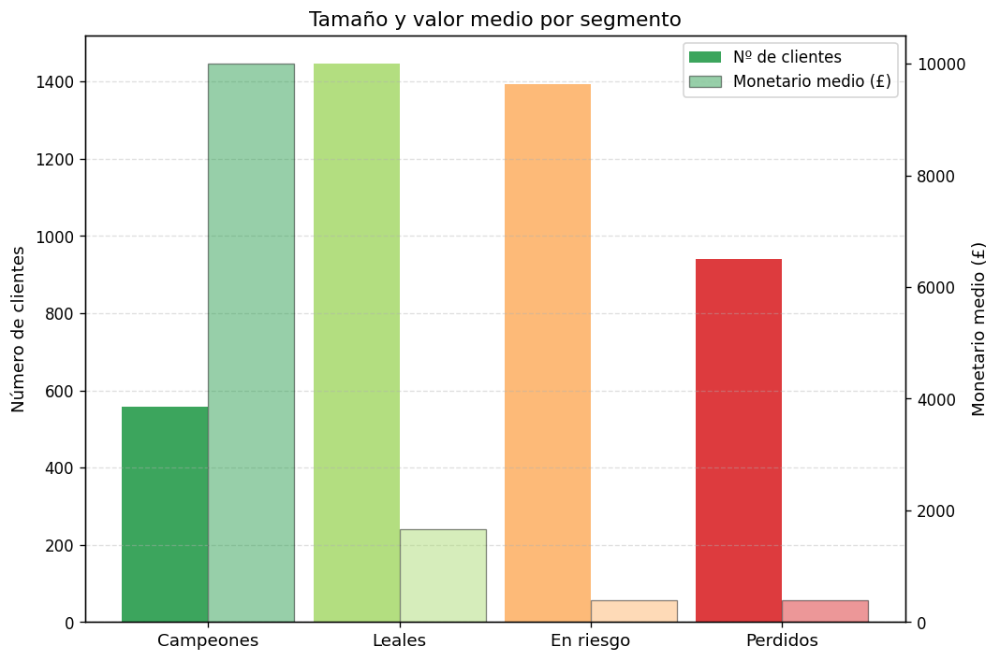

# cohort-rfm-ecommerce

Análisis de comportamiento de clientes de un e-commerce real: cohortes de retención, RFM (Recencia, Frecuencia, Monetario) y segmentación con k-means, con recomendaciones accionables por segmento.

<p align="center">
  
  
  
  
  
</p>

---

## Resumen

Este proyecto aplica tres técnicas complementarias sobre datos transaccionales de un retailer en línea del Reino Unido:

- **Cohortes de retención**: mide qué porcentaje de clientes de cada mes de adquisición vuelve a comprar en meses posteriores.
- **RFM**: puntúa a cada cliente según cuándo compró por última vez (Recencia), con qué frecuencia (Frecuencia) y cuánto gastó (Monetario).
- **Segmentación con k-means**: agrupa clientes en segmentos homogéneos y formula una recomendación específica para cada uno.

---

## Pregunta de negocio

> ¿Quiénes son los clientes más valiosos, cómo retienen las cohortes a lo largo del tiempo y qué acción concreta corresponde a cada segmento?

---

## Datos

**Fuente**: [Online Retail — UCI Machine Learning Repository](https://archive.ics.uci.edu/dataset/352/online+retail)

Transacciones de un retailer en línea del Reino Unido entre diciembre de 2010 y diciembre de 2011. El archivo crudo pesa aproximadamente 22 MB (formato `.xlsx`) y **no se versiona en este repositorio**.

Para descargarlo:

```bash
python descargar_datos.py
```

El archivo se guarda en `datos/Online Retail.xlsx`. Para los tests automatizados se incluye una muestra representativa en `datos/muestra.csv`, que sí está versionada.

---

## Metodología

1. **Limpieza**: eliminación de facturas canceladas (código `C`), filas con `CustomerID` nulo, cantidades no positivas y precios unitarios negativos.
2. **Cohortes de retención**: asignación de cada cliente a la cohorte del mes en que realizó su primera compra; cálculo de tasa de retención mes a mes mediante tabla dinámica.
3. **RFM**:
   - **Recencia**: días desde la última compra hasta la fecha de referencia (`2011-12-10`).
   - **Frecuencia**: número de facturas distintas por cliente.
   - **Monetario**: gasto total acumulado.
4. **Estandarización**: transformación logarítmica (`log1p`) seguida de escalado estándar (`StandardScaler`) para reducir el efecto de valores extremos.
5. **K-means**: selección de `k` mediante el método del codo (rango 2–10); ajuste final con `k=4`.

---

## Resultados

### Contexto general

| Métrica | Valor |
|---|---|
| Periodo | 2010-12-01 — 2011-12-09 |
| Clientes únicos | 4.338 |
| Facturas únicas | 18.532 |
| País con más transacciones | Reino Unido |

### Cohortes de retención

La tasa de retención media en el **mes 1** es del **20,6 %** y en el **mes 3** del **23,2 %**. La cohorte de diciembre de 2010 muestra la retención más alta a lo largo de todos los meses de seguimiento, probablemente porque concentra a los clientes más leales y habituales del retailer.



*El mapa de calor muestra el porcentaje de retención mes a mes para cada cohorte de adquisición. Las celdas más oscuras indican mayor retención. Se aprecia que la cohorte de diciembre 2010 mantiene tasas superiores al resto durante todo el periodo.*

### Selección de k para k-means



*La curva de inercia presenta un codo pronunciado en `k=4`, punto a partir del cual añadir más clústeres reduce la inercia de forma marginal. Este criterio justifica la elección de cuatro segmentos.*

### Segmentación RFM (k-means, k=4)

| Segmento | Clientes | % | Recencia media | Frecuencia media | Monetario medio |
|---|---|---|---|---|---|
| Campeones | 558 | 12,9 % | 19,5 días | 16,0 | £10.007,54 |
| Leales | 1.447 | 33,4 % | 45,4 días | 4,3 | £1.667,67 |
| En riesgo | 1.392 | 32,1 % | 58,1 días | 1,5 | £392,89 |
| Perdidos | 941 | 21,7 % | 259,2 días | 1,4 | £390,20 |



*El gráfico de dispersión enfrenta la frecuencia de compra con el gasto total, con cada punto coloreado según su segmento. Los Campeones se separan con claridad en la esquina superior derecha; los Perdidos quedan agrupados en el extremo inferior izquierdo.*



*El gráfico de perfiles muestra el tamaño de cada segmento y su valor monetario medio. Los Campeones representan apenas el 12,9 % de la base pero concentran el mayor gasto por cliente, lo que los convierte en el segmento de mayor impacto en ingresos.*

---

## Recomendaciones por segmento

| Segmento | Acción recomendada |
|---|---|
| **Campeones** | Programa de fidelización VIP: acceso anticipado a nuevos productos, descuentos exclusivos, trato preferencial en atención al cliente. |
| **Leales** | Aumentar frecuencia con cross-selling y bundles: recomendaciones personalizadas basadas en historial, ofertas de volumen. |
| **En riesgo** | Campañas de reactivación urgentes: correos personalizados, cupones de descuento con caducidad corta antes de que pasen a «Perdidos». |
| **Perdidos** | Campaña de win-back de bajo coste o, si no responden, reasignar el presupuesto a captación de nuevos clientes. |

---

## Cómo reproducirlo

```bash
# 1. Crear entorno virtual e instalar dependencias
python -m venv .venv
.venv\Scripts\activate        # Windows
# source .venv/bin/activate   # Linux / macOS

pip install -r requirements-dev.txt
pip install -e .

# 2. Descargar el dataset completo (~22 MB)
python descargar_datos.py

# 3. Generar el informe y las visualizaciones
python informe.py

# 4. Ejecutar los tests
pytest tests -v
```

---

## Estructura

```
cohort-rfm-ecommerce/
├── analisis/
│   ├── limpieza.py        # Preprocesamiento y filtrado
│   ├── cohortes.py        # Tabla de retención por cohorte
│   ├── rfm.py             # Cálculo de métricas RFM
│   └── graficos.py        # Generación de visualizaciones
├── tests/                 # 24 pruebas unitarias
├── datos/
│   └── muestra.csv        # Muestra versionada para tests
├── docs/img/              # Gráficos exportados
├── descargar_datos.py     # Descarga Online Retail.xlsx
├── informe.py             # Script principal de análisis
├── pyproject.toml
├── requirements.txt
└── requirements-dev.txt
```

---

## Licencia

MIT — véase el archivo [LICENSE](LICENSE).

---

## Contacto

[](https://www.linkedin.com/in/juanalvarezgh)
[](mailto:juanalvarezghcode@gmail.com)
[](https://github.com/JuanAlvarezgh)
